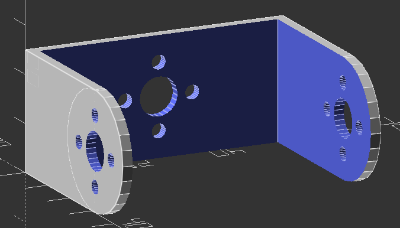

# OpenSCAD Robot Parts
Programmatic OpenSCAD Robot Parts. I will add more as time passes.

## Robot U Bracket (Servo Type)

This U Bracket is commonly found in cheap robot platforms.
You can customize almost all variables. The notable ones to customize are:

*bracket_length - Common Sizes are 44 and 64.5*

Any size should have 12.5 taken from the number, the file does this for you if you plug your number in correctly

Printed in PLA. Photo shows a Metal Servo Horn and 8mm Flange Bearing mounted to the U Bracket.
